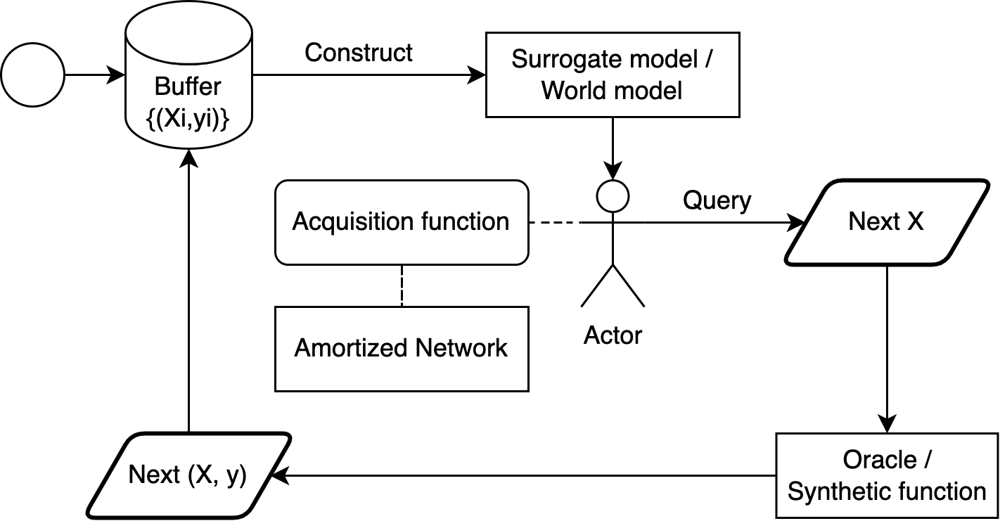

# Non-myopic H-Entropy Search

This repo support Bayesian optimization experiments with non-myopic H-Entropy Search. Bayesian optimization is a widely used approach for making optimal decisions in uncertain scenarios by acquiring information through costly experiments. Many real-world applications can be cast as instances of this problem, ranging from designing biological sequences to conducting ground surveys. In these contexts, the cost associated with each experiment can be dynamic and non-uniform. For instance, in cases where each experiment corresponds to a location, there exists a variable travel cost contingent on the distances between successive experiments. Conventional Bayesian optimization techniques, often reliant on myopic acquisition functions and assuming a fixed cost structure, yield suboptimal results in dynamic cost environments. To address these limitations, we introduce a scalable nonmyopic acquisition function grounded in a decision-theoretic extension of mutual information. Our empirical evaluations demonstrate that our method outperforms numerous baseline approaches across a range of global optimization tasks.

There are two main experiments:
1. Synthetic experiments: We consider the synthetic environment with the following settings:
    - 2D environment: Ackley, Alpine, Beale, Branin, EggHolder, Griewank, HolderTable, Levy, SixHumpCamel,  StyblinskiTang, and SynGP
    - 4D environment: Powell
    - 6D environment: Hartmann
    - 8D environment: Cosine8
2. Real-world experiments: We consider the real-world environment with protein sequence optimization.

## Pipeline code description
Our pipeline is summarized as below figure.


The main process is located in [main.py](main.py). Starting with some initialized data points in the buffer, we construct the world model (surrogate model). This model is then used by the actor (in [actor.py](actor.py)) to query the next observed data point. This data point is chosen to maximize the value of an acquisition function (in [acqfs.py](acqfs.py)). An amortized network (in [amortized_network.py](amortized_network.py)) can be utilized to reduce the number of parameters when optimizing the acquisition function. The observed data point will be added to the buffer. Then the whole process will be repeated.

### List of supporting acquistion functions
- Multi-Step Trees
- Simple Regret
- Expected Improvement
- Probability of Improvement
- Upper Confidence Bound
- Knowledge Gradient
- H-Entropy Search

## How to reproduce
1. Install the requirements
```bash
 pip install -r requirements.txt
 pip install git+https://github.com/hiyouga/LLaMA-Factory.git@942362d0087345e468e0ae541dcca9b684d74d1a
```
2. Run the experiments by bash script
```bash
python main.py [-h] [--seed SEED] [--task TASK] [--env_name ENV_NAME] [--env_noise ENV_NOISE] [--env_discretized ENV_DISCRETIZED] [--algo ALGO]
               [--cost_fn COST_FN] [--plot PLOT] [--gpu_id GPU_ID] [--cont CONT]

options:
  --seed SEED
  --task TASK
  --env_name ENV_NAME
  --env_noise ENV_NOISE
  --env_discretized ENV_DISCRETIZED
  --algo ALGO
  --cost_fn COST_FN
  --plot PLOT
  --gpu_id GPU_ID
  --cont CONT
```
3. Compute metrics
```bash
python compute_metrics.py [-h] [--seed SEED] [--task TASK] [--env_name ENV_NAME] [--env_noise ENV_NOISE] [--env_discretized ENV_DISCRETIZED]
                          [--algo ALGO] [--cost_fn COST_FN] [--plot PLOT] [--gpu_id GPU_ID] [--cont CONT]

options:
  --seed SEED
  --task TASK
  --env_name ENV_NAME
  --env_noise ENV_NOISE
  --env_discretized ENV_DISCRETIZED
  --algo ALGO
  --cost_fn COST_FN
  --plot PLOT
  --gpu_id GPU_ID
  --cont CONT
```
4. Draw regrets
```bash
python draw_metrics.py
```

## Running mass experiments with WandB Sweep
1. Firstly, run below command to get the command to start sweep agent(s). 
```bash
wandb sweep wnb_configs/full.yaml
```
The result will look like "wandb agent your_name/nonmyopia/some_text".

2. Start a single sweep agent.
```bash
CUDA_VISIBLE_DEVICES=0 wandb agent your_name/nonmyopia/some_text &
```
If you want to start more agents, simply rerun above command of different terminals/servers/... You can start as many sweep agents as your server can handle.

## Analyzing world models
```bash
python test_surrogate_convergence.py [-h] [--seeds SEEDS [SEEDS ...]] [--env_names ENV_NAMES [ENV_NAMES ...]] [--env_noise ENV_NOISE]
                                     [--env_discretized] [--gpu_id GPU_ID]

options:
  --seeds SEEDS [SEEDS ...]
  --env_names ENV_NAMES [ENV_NAMES ...]
  --env_noise ENV_NOISE
  --env_discretized
  --gpu_id GPU_ID
```
# Real World Experiment: LLM Sequence Design

This source code is used to deisgn sequence(s) to maximize/minimize a property. It includes three main models:
- **Oracle** is used as groundtruth to replace wet-lab experiments
- **WorldModel** is the reward model trained with current observed data
- **Policy** is the amortized network with ability to generate better sequence(s)


>[!INFO] Variables marked with "<  ...  >" are user-specific and have to be adapted before running the code.

# SETUP
## 1 Preparation

Download this GITHUB into your DFS - file system (<GIT_PATH>).

Before installation, please download and install miniconda and python ([Setup Instructions](https://docs.google.com/document/d/1PSTLJdtG3AymDGKPO-bHtzSnDyPmJPpJWXLmnJKzdfU/edit#heading=h.4tch43r93szq)). Then, create and activate a new conda environment by running the following code. Please choose your own < USERNAME> and any preferred name for "<ENV_NAME>".

```bash
source /dfs/scratch0/<USERNAME>/miniconda3/bin/activate
conda create -n <ENV_NAME> python=3.10 -y
conda activate <ENV_NAME>
```

All required packages are listed in the [requirements](requirements.txt) file, so install all requirements:
>FIRST CD INTO...?
```bash
pip install -r requirements.txt
```
This might take a while, but we can use that time by creating a huggingface (HF) account on https://huggingface.co. After that, create a new model repository https://huggingface.co/new with your Username (<HF_USER>) and any Model (<HF_MODEL>) name you prefer. This Repo is used later to store modified models and datasets. Now create a new Access Token on Huggingface (Settings -> Access Tokens -> New token). It is crucial to copy paste that token (<hf_token>) into a safe space, since you will need it later and can't access it again. Now go to your freshly created Token and click on Manage -> Edit permissions. Make sure, to enable all the Repository permissions of <HF_MODEL> as well as all User permissions that are listed under "Repos".


## 2 Building Oracle

First, cd into the llm_sequence_design folder <GIT_PATH>/nonmyopia/llm_sequence.
Make sure, your conda environment is activated.

### 2.1 Data preprocessing and embedding
Example with ESM2 model and Proteina Fluorescence dataset. 
>Adapt the '--wm_export_hub_model_id' and '--wm_hf_hub_token' arguments with your personal variable names.
```bash
CUDA_VISIBLE_DEVICES=0 accelerate launch \
    --config_file examples/accelerate/single_config.yaml \
    extract_emb_dataset.py \
    --model_name_or_path facebook/esm2_t33_650M_UR50D \
    --dataset_dir ./ \
    --template default \
    --dataset proteinea/fluorescence \
    --overwrite_cache False \
    --preprocessing_num_workers 8 \
    --num_train_epochs 0 \
    --export_hub_model_id <HF_USER>/<HF_MODEL> \
    --hf_hub_token <hf_token> \
    --output_dir ckpts/embedding
```

Now, the newly created dataset needs to be added into the dataset_info.json file under <GIT_PATH>/nonmyopia/llm_sequence_design/data/dataset_info.json. Open the file and insert:
```bash
  "<HF_USER>/<HF_MODEL>": {
    "hf_hub_url": "<HF_USER>/<HF_MODEL>",
    "formatting": "oracle"
  }
```

### 2.2 Training

In this step, we simply train linear models using sklearn. Currently, three models are suppported: linear, ridge, bayesridge. 

>Adapt the '--dataset' argument with the same personal variables as in '--wm_export_hub_model_id'. Automaticly, a huggingface dataset will be created with the same RepoID as your model's.
```bash
python src/train_bash.py \
    --seed 2 \
    --stage oracle \
    --do_train \
    --do_eval \
    --template default \
    --model_name_or_path bayesridge \
    --dataset <HF_USER>/<HF_MODEL> \
    --emb_enabled True \
    --label_names rewards \
    --val_size 0.0 \
    --preprocessing_num_workers 32 \
    --output_dir ckpts/oracle_bayesridge-seed2
```

### 2.3 Embedding model selection
To selecct the most suited embedding model for next steps, we tested various well-known LLMs. To do this, firstly, we embedd our dataset by various models, then run below script. Note: This script is designed to work with bayesridge and upto 7 embedding models, feel free to edit it by `hf_embedding_names` variable. 
```bash
python test_oracle.py
```

## 3 Runing full pipeline code
Currently, this code is only support HES-TS-AM acquision function. Some notes are: 
- The world model should has the same embedding model with oracle.
- Policy model can be different models with the above two models.
- We would better finetuning Policy with LoRA to minimzing the catastrophic knowledge loss.
  
To run full pipeline, please use script in [Pipeline Script](scripts/run_exp.sh)

## 4 Next steps
- Re-adding the histories of sequence when optimizing with lookahead. See `configs.py` for designed prompt.
- Verify the correctness of modified PPO pipeline.
- Implement more acquisition functions.
